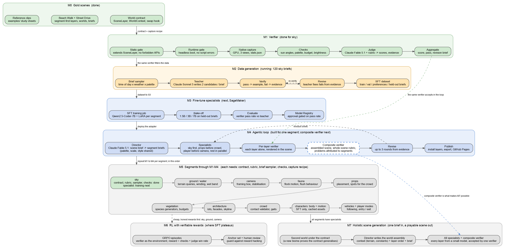
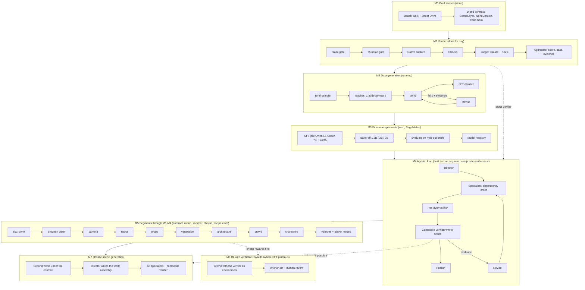

# Pipeline stages and milestones

Source: `design/pipeline.dot` (`dot -Tpng design/pipeline.dot -o design/pipeline.png`).
The same flow in Mermaid, for places that render it:

| Milestone | State | Exit criterion |
|---|---|---|
| M0 Gold scenes | done | two worlds under one contract, published |
| M1 Verifier | done for sky | gates veto, checks + judge agree with a human anchor set |
| M2 Data generation | running | ~100 verified sky examples across the brief space, held-out slice kept |
| M3 Fine-tune | next | a specialist whose held-out pass rate is within reach of the teacher's, registered |
| M4 Agentic loop | built for one segment | composite verifier added; a new scene brief rendered and accepted with trained specialists, no hand edits |
| M5 Segments | sky only | each segment has a contract, rubric, sampler, checks and capture recipe, and a specialist through M1 to M4, in the order shown |
| M6 RL | later | pass rate above SFT on the same held-out briefs, anchor agreement unchanged |
| M7 Holistic generation | later | one brief in, a playable scene out: the director writes the world assembly, every layer comes from a specialist, the composite verifier accepts |

**Composite verifier.** The per-layer verifier renders one candidate inside
the shipped scene and scores it against its segment brief. The composite
verifier renders the whole assembled scene, scores it with a whole-scene
rubric (coherence of palette, scale and style; nothing intersecting; budget
as a whole), and attributes each problem to a segment so the director can
route revision briefs. It is what catches layers that pass alone and clash
together, and it is the acceptance test for M7.
