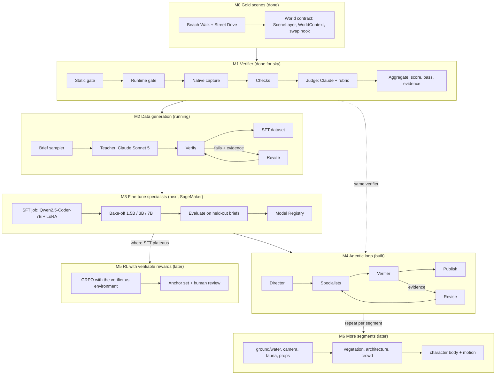

# Pipeline stages and milestones

Source: `design/pipeline.dot` (`dot -Tpng design/pipeline.dot -o design/pipeline.png`).
The same flow in Mermaid, for places that render it:

| Milestone | State | Exit criterion |
|---|---|---|
| M0 Gold scenes | done | two worlds under one contract, published |
| M1 Verifier | done for sky | gates veto, checks + judge agree with a human anchor set |
| M2 Data generation | running | ~100 verified sky examples across the brief space, held-out slice kept |
| M3 Fine-tune | next | a specialist whose held-out pass rate is within reach of the teacher's, registered |
| M4 Agentic loop | built, on the teacher | a new scene brief rendered and accepted with trained specialists, no hand edits |
| M5 RL | later | pass rate above SFT on the same held-out briefs, anchor agreement unchanged |
| M6 More segments | later | each segment through M1 to M4 |
